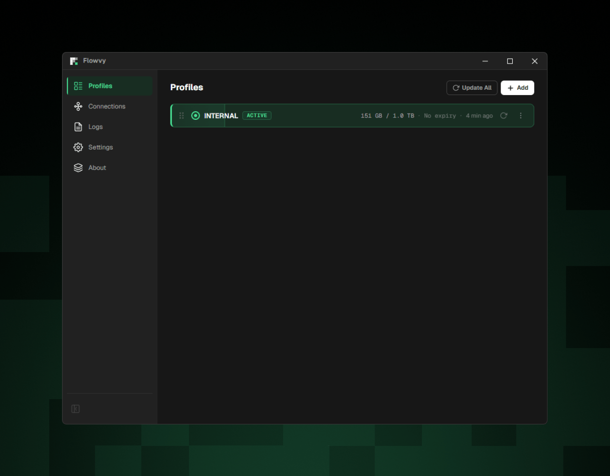
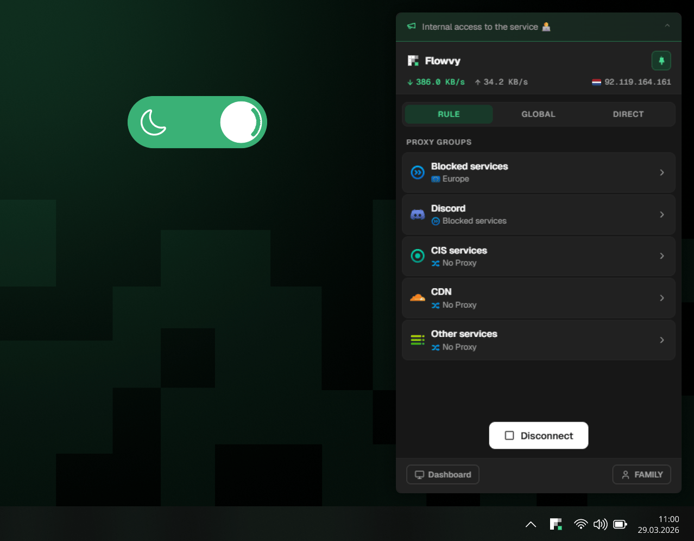

**English** · [Русский](README.ru.md)

 

### A modern proxy client powered by the [mihomo](https://github.com/MetaCubeX/mihomo) engine

Windows · macOS · Linux

[**Download**](#installation) · [**Documentation**](https://docs.flowvy.io/) · [**Telegram**](https://t.me/flowvy_client)

 

 

## Why Flowvy

- **Built for subscriptions** — Flowvy understands provider subscriptions more deeply than other clients: traffic and expiry on the profile card, provider announcements and renewal links right inside the app, and a fallback URL for when the primary one is unavailable
- **Tray popup** — connect, switch mode, and pick a host in two clicks, just like commercial VPN clients. No need to open the main window
- **Simple without losing depth** — one active profile, clear groups and hosts, no thicket of settings. And when you want to dig deeper, a YAML editor with the mihomo schema, provider setting overrides, and a live connections map are already there
- **TUN without the nagging** — administrator rights are requested only once, when installing the helper service. After that, TUN is just a toggle
- **Private logs** — your connection history is never written to disk. For support requests there's a diagnostic mode: detailed logs are gathered into a protected archive only while you keep it enabled
- **Works offline, too** — groups and selected hosts stay visible without a connection, and your selection is restored on the next connect
- **Native and lightweight** — Rust and the system WebView instead of Electron: fast startup and a modest memory footprint
- **Beta next to stable** — the beta channel installs as a separate app and never touches your main installation

## Screenshots

## Installation

| Platform | Download | Requirements |
| --- | --- | --- |
| **Windows** | [Flowvy_x64.exe](https://github.com/flowvy/desktop/releases/latest/download/Flowvy_x64.exe) | Windows 10+ |
| **macOS** | [Flowvy_arm64.dmg](https://github.com/flowvy/desktop/releases/latest/download/Flowvy_arm64.dmg) | macOS 10.15+, Apple Silicon |
| **Linux** | [Flowvy_x64.deb](https://github.com/flowvy/desktop/releases/latest/download/Flowvy_x64.deb) | Debian / Ubuntu |

All versions are on the [releases](https://github.com/flowvy/desktop/releases) page. Detailed installation instructions are in the [documentation](https://docs.flowvy.io/).

> [!TIP]
> Want new features sooner? **Flowvy Beta** installs alongside the stable version and updates independently — see [beta version](https://docs.flowvy.io/getting-started/beta) in the docs.

## Community and support

- [Telegram group](https://t.me/flowvy_client) — news, discussion, and help
- [Issues](https://github.com/flowvy/desktop/issues) — bug reports and suggestions
- [Documentation](https://docs.flowvy.io/) — guides for every feature

---

Flowvy is proprietary software. This repository hosts releases and accepts bug reports.

