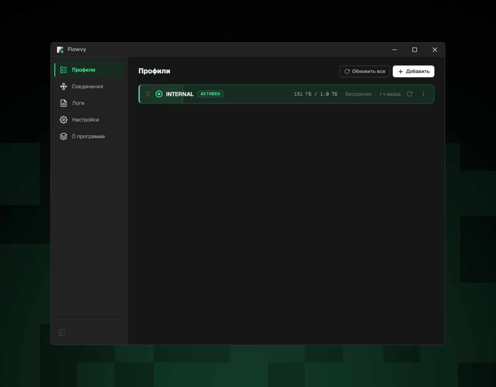
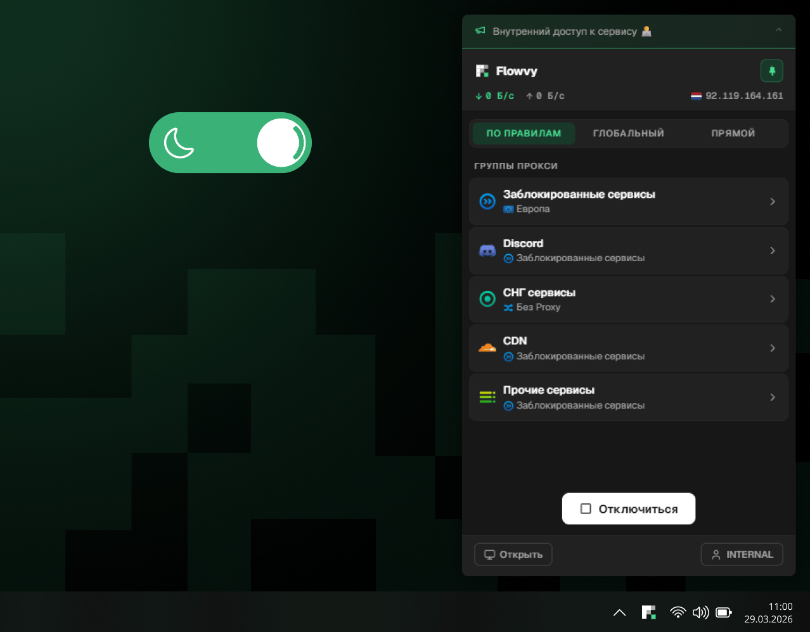

[English](README.md) · **Русский**

 

### Современный прокси-клиент на движке [mihomo](https://github.com/MetaCubeX/mihomo)

Windows · macOS · Linux

[**Скачать**](#установка) · [**Документация**](https://docs.flowvy.io/) · [**Telegram**](https://t.me/flowvy_client)

 

 

## Почему Flowvy

- **Создан для подписок** — Flowvy понимает подписки провайдеров глубже других клиентов: трафик и срок действия на карточке профиля, объявления и ссылки на продление прямо в интерфейсе, резервный URL на случай недоступности основного
- **Попап у трея** — подключение, смена режима и выбор хоста в два клика, как в коммерческих VPN-клиентах. Основное окно открывать не обязательно
- **Простота без потери глубины** — один активный профиль, понятные группы и хосты, никакого леса настроек. А когда нужно копнуть — YAML-редактор со схемой mihomo, переопределения настроек провайдера и живая карта соединений уже на месте
- **TUN без лишних запросов** — права администратора нужны один раз, при установке вспомогательного сервиса. Дальше TUN включается обычным переключателем
- **Приватные логи** — история ваших соединений не записывается на диск. Для обращения в поддержку есть режим диагностики: подробные логи собираются в защищённый архив только пока вы его включили
- **Работает и офлайн** — группы и выбранные хосты видны без подключения, выбор восстанавливается при следующем соединении
- **Нативный и лёгкий** — Rust и системный WebView вместо Electron: быстрый запуск и скромный аппетит к памяти
- **Бета рядом со стабильной** — бета-канал ставится отдельным приложением и не трогает основную установку

## Скриншоты

## Установка

| Платформа | Загрузка | Требования |
| --- | --- | --- |
| **Windows** | [Flowvy_x64.exe](https://github.com/flowvy-proxy/desktop/releases/latest/download/Flowvy_x64.exe) | Windows 10+ |
| **macOS** | [Flowvy_arm64.dmg](https://github.com/flowvy-proxy/desktop/releases/latest/download/Flowvy_arm64.dmg) | macOS 10.15+, Apple Silicon |
| **Linux** | [Flowvy_x64.deb](https://github.com/flowvy-proxy/desktop/releases/latest/download/Flowvy_x64.deb) | Debian / Ubuntu |

Все версии — на странице [релизов](https://github.com/flowvy-proxy/desktop/releases). Подробные инструкции по установке — в [документации](https://docs.flowvy.io/).

> [!TIP]
> Хотите получать новые функции раньше? **Flowvy Beta** устанавливается рядом со стабильной версией и обновляется независимо — см. [бета-версия](https://docs.flowvy.io/getting-started/beta) в документации.

## Сообщество и поддержка

- [Telegram-группа](https://t.me/flowvy_client) — новости, обсуждения, помощь
- [Issues](https://github.com/flowvy-proxy/desktop/issues) — баг-репорты и предложения
- [Документация](https://docs.flowvy.io/) — инструкции по всем функциям

---

Flowvy — проприетарное программное обеспечение. В этом репозитории публикуются релизы и принимаются баг-репорты.

